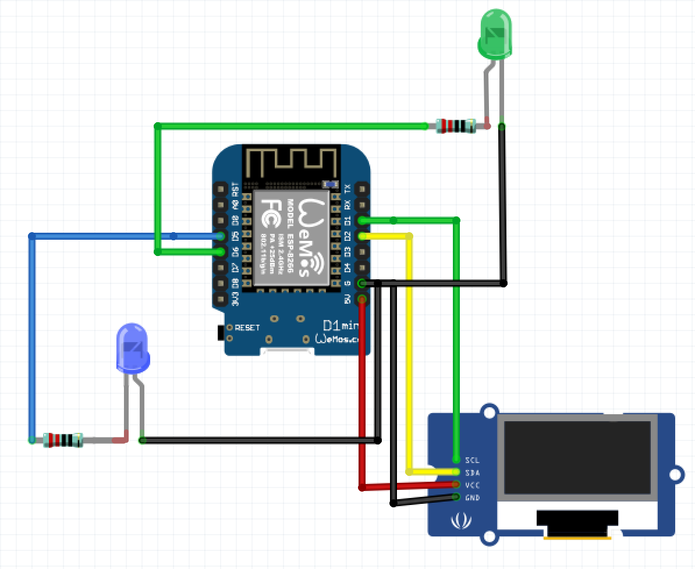
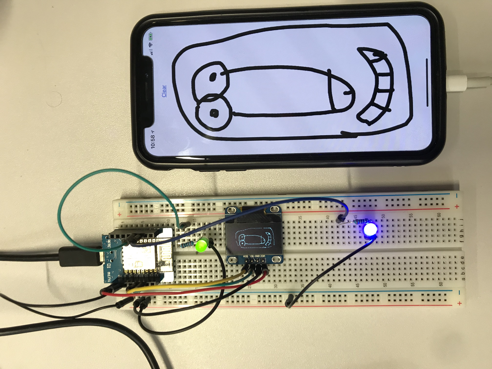

# OledPaint
Drawing app with Wemos D1 Mini

# Requirements
* Wemos D1 Mini
* Oled Screen
* Mac os x
* 2 Resistance 200 Ohms
* 2 Leds

# Circuit Diagram

# Library
- Download U8g2Lib ([link](https://github.com/olikraus/u8g2/blob/master/cppsrc/U8g2lib.h))
- Download ESP8266 ([link](https://github.com/esp8266/Arduino/tree/master/libraries/ESP8266WiFi))

# Installation
- In your Mac os x :
- Install Arduino ([download page](https://www.arduino.cc/download_handler.php?f=/arduino-1.8.5-macosx.zip))
- Install Xcode
- Install Cocoapods
- In your terminal :
`$ cd code_swift/`
`$ pod install`

# How to launch
- Connect your Iphone and Mac os x on the same network
- Plug the arduino to your Mac os x
- Send Arduino code in your Arduino
- Run xcode and launch swift project
- Plug your Iphone to your Mac os x (Modify the ip address for UDP) and run the project on the Iphone (Or you could use the simulator)
- Start drawing and see the result on the Oled

